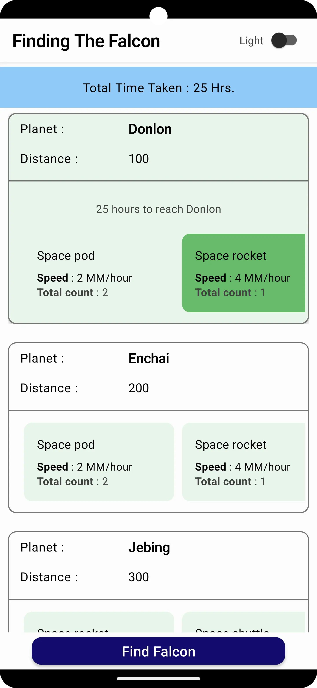
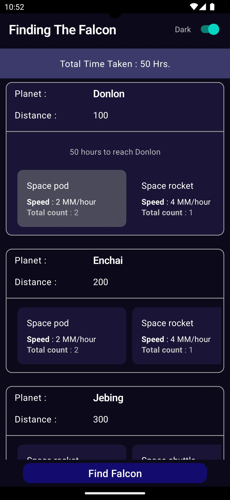

A multi-module project using clean architecture and following use-case pattern.
Supports multiple theme.

[Debug Apk](apk/Finding-Falcon-debug.apk)

**Used**
  * Hilt for DI (In multiple modules)
  * Epoxy Recycler view, Used both ways:  
     * Data binding
     * Creating Models and Controllers
  * Lottie animation view
  * Retrofit for api calls
  * Made custom views 
  * Intuit [sdp](https://github.com/intuit/sdp) and [ssp](https://github.com/intuit/ssp)

***Sample Images***
* 
* 